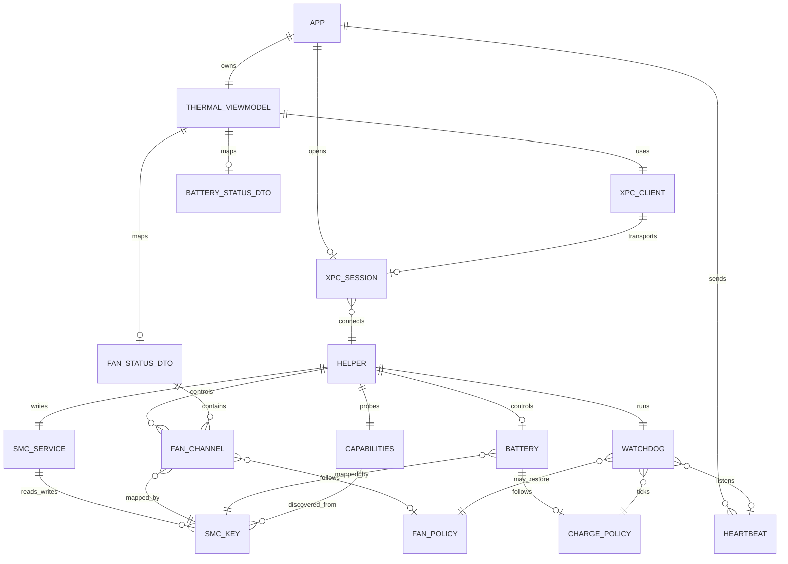
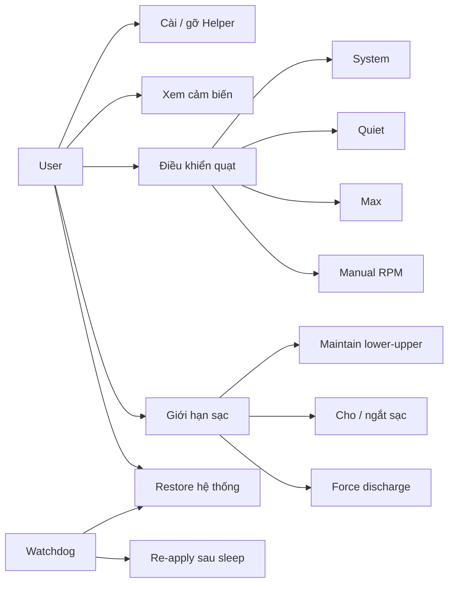
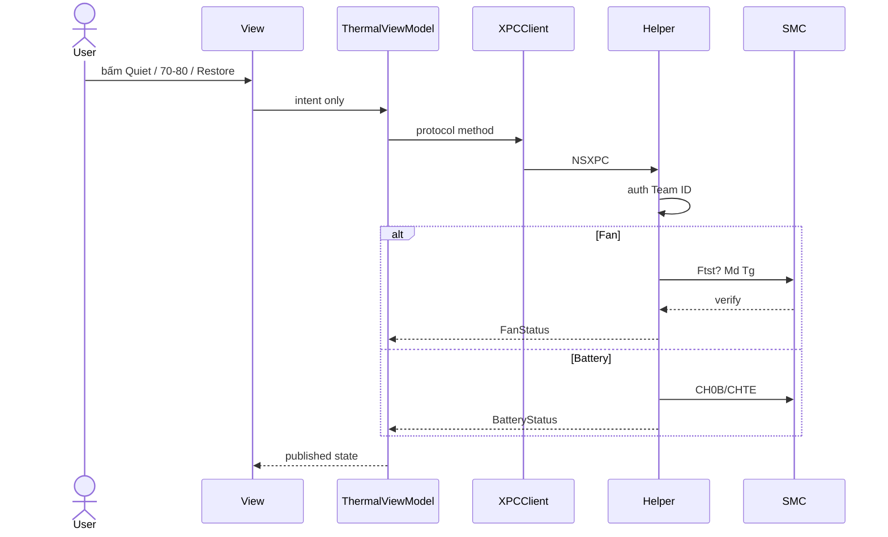

# ERD + Sơ đồ chức năng — Thermal Control

App không có database. ERD dưới đây là **mô hình miền** (domain) để Build App / MVVM bám đúng thực thể, quan hệ và use case.

---

## 1. ERD — thực thể & quan hệ

### Bảng thực thể

| Entity | 1 dòng nghĩa | Thuộc tính chính |
|---|---|---|
| APP | Process SwiftUI unprivileged | bundleId, teamId |
| THERMAL_VIEWMODEL | State + intent UI | isConnected, lastError, manualRPM, chargeUpper/Lower |
| XPC_CLIENT | Transport | machServiceName |
| XPC_SESSION | Kết nối App↔Helper | pid, authorized |
| HELPER | Daemon root | version, machName |
| CAPABILITIES | Kết quả probe lúc boot | fanCount, fanControl, ftstPresent, batteryControl, batteryFamily |
| FAN_CHANNEL | 1 quạt vật lý | index, actualRPM, targetRPM, minRPM, maxRPM, modeKey, modeRaw |
| FAN_POLICY | Ý muốn quạt | system / quiet / max / manual(rpm, index?) |
| BATTERY | Pin nội bộ (0..1) | present, percent, amperageMA, voltageMV, externalAC |
| CHARGE_POLICY | Giới hạn sạc | upper, lower, chargingEnabled, forceDischarge, maintainActive |
| SMC_SERVICE | Lớp IOKit | connection |
| SMC_KEY | 1 key 4 ký tự | name, type, size, readable, writable |
| WATCHDOG | An toàn vòng 2s | lastHeartbeat, thermalTrip |
| HEARTBEAT | Ping từ app | token, timestamp |
| FAN_STATUS_DTO / BATTERY_STATUS_DTO | Payload XPC (NSSecureCoding) | snapshot để VM bind |

### Quan hệ (cardinality)

| Từ | Đến | |
|---|---|---|
| APP | HELPER | 0..1 session (chưa cài helper thì 0) |
| HELPER | FAN_CHANNEL | 0..n (`FNum`) |
| HELPER | BATTERY | 0..1 (mini/studio = 0) |
| FAN_CHANNEL | FAN_POLICY | n quạt theo 1 policy (hoặc manual theo index) |
| BATTERY | CHARGE_POLICY | 0..1 |
| FAN/BATTERY | SMC_KEY | n key (Ac/Tg/Md, CH0B/CHTE, …) |
| APP | WATCHDOG | 1 heartbeat stream; timeout → restore fan |

---

## 2. Chức năng (use case)

| Mã | Chức năng | Actor | Tầng xử lý | Entity đụng |
|---|---|---|---|---|
| UC1 | Cài helper (`SMAppService` phụ, `install_helper.sh` chính) | User + admin | Service `HelperInstall` | HELPER |
| UC2 | Đọc RPM, %, mA, capabilities | User | VM ← XPC ← Helper | FAN_CHANNEL, BATTERY, CAPABILITIES |
| UC3 | Đổi mode / target quạt | User | VM intent → FanController | FAN_POLICY, FAN_CHANNEL, SMC_KEY |
| UC4 | Maintain / inhibit / discharge | User | VM intent → BatteryController | CHARGE_POLICY, BATTERY |
| UC5 | Trả quạt + mở sạc mặc định | User hoặc Watchdog | Helper | FAN_POLICY, CHARGE_POLICY |
| UC6 | Sleep/wake re-apply | Watchdog | Helper 10s tick | FAN_POLICY, Ftst |
| UC7 | Heartbeat chết 45s | Watchdog | Helper | HEARTBEAT, FAN_POLICY |
| UC8 | Quá nhiệt 105°C / 8s | Watchdog | Helper | SMC_KEY nhiệt, FAN_POLICY |

---

## 3. Luồng dữ liệu chức năng chính

---

## 4. Map ERD → file MVVM

| Entity | File |
|---|---|
| DTO Fan/Battery/Capabilities | `Shared/Models/*` |
| Protocol XPC | `Shared/XPC/ThermalHelperProtocol.swift` |
| THERMAL_VIEWMODEL | `App/ViewModels/ThermalViewModel.swift` |
| XPC_CLIENT | `App/Services/XPCClient.swift` |
| Views | `App/Views/*` — không giữ entity SMC |
| SMC_SERVICE | `Helper/SMCService.swift` |
| FAN_POLICY + channel | `Helper/FanController.swift` |
| CHARGE_POLICY | `Helper/BatteryController.swift` |
| WATCHDOG | `Helper/SafetyWatchdog.swift` |
| Session + auth | `Helper/XPCListener.swift` |

---

## 5. Invariant (ràng buộc miền)

1. APP không có quan hệ trực tiếp tới SMC_KEY.
2. FAN_POLICY chỉ Helper được persist (trong memory daemon). App chỉ gửi intent.
3. `FNum = 0` ⇒ không có FAN_CHANNEL ⇒ ẩn UC3.
4. `batteryPresent = false` ⇒ không có BATTERY ⇒ ẩn UC4.
5. WATCHDOG luôn tồn tại khi HELPER sống.
6. Timeout heartbeat chỉ restore **quạt**, không tự xóa CHARGE_POLICY trừ khi gọi UC5 đầy đủ.

Dùng ERD này khi code: mỗi màn hình View bind snapshot DTO, không tự tạo quan hệ SMC.
